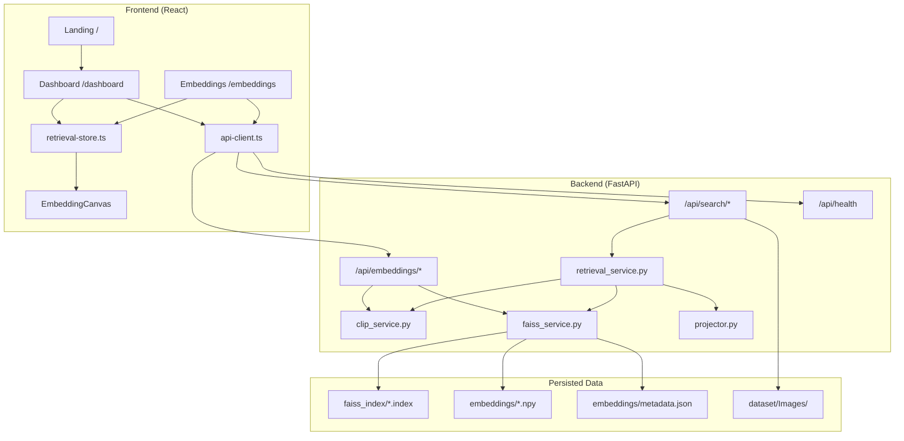

# Semantix — Project Documentation

## 1. What Is This Project?

**Semantix** is a **multimodal AI semantic retrieval platform**. It lets users search across **images and text** using a shared embedding space powered by a Vision-Language Model (VLM), not keyword matching.

Users can:

- Search **images from natural language** (Text → Image)
- Search **captions from uploaded images** (Image → Text)
- **Visualize** query and results in a live 2D embedding map
- **Control retrieval depth** with dynamic Top-K selection
- Switch between **light and dark themes** across the app

The system is built as a **full-stack application**:

- **Frontend** — React dashboard with real-time visualization
- **Backend** — FastAPI API with CLIP encoding + FAISS vector search
- **ML Pipeline** — Offline scripts to embed a dataset and build indexes

---

## 2. Features

### Core Retrieval

| Feature | Description |
|--------|-------------|
| **Text → Image Retrieval** | Enter a natural language query; get ranked images by semantic similarity |
| **Image → Text Retrieval** | Upload an image; get ranked captions/descriptions |
| **Cosine Similarity Ranking** | Results ranked by inner product on L2-normalized CLIP vectors |
| **Sub-second Search** | FAISS `IndexFlatIP` nearest-neighbor search |
| **Mock Fallback** | Frontend falls back to demo data if backend is offline |

### Dynamic Top-K Retrieval

| Feature | Description |
|--------|-------------|
| **Top-K Selector** | Dropdown: `1, 3, 5, 7, 8, 10, 12` |
| **Live Re-retrieval** | Changing K re-runs FAISS search automatically |
| **Real-time UI Update** | Results grid and embedding map refresh instantly |
| **Cross-page Sync** | K and retrieval state shared via `retrieval-store` |

### Embedding Visualization

| Feature | Description |
|--------|-------------|
| **2D Projection** | PCA (default), t-SNE, UMAP supported on backend |
| **Interactive Canvas** | Pan, zoom, hover tooltips, animated query→result curves |
| **Neighborhood Halo** | Visual radius scales with K and neighbor spread |
| **Semantic Metrics** | Spread, density, avg similarity on embeddings page |
| **Dashboard Mini-map** | Live preview; full map on `/embeddings` |

### UI/UX

| Feature | Description |
|--------|-------------|
| **Light / Dark Theme** | Global toggle in navbar, persisted in `localStorage` |
| **Smooth Transitions** | Theme changes animate across all pages |
| **Glass-morphism UI** | Modern AI-dashboard styling |
| **Responsive Design** | Works on mobile and desktop |
| **Landing Page** | Marketing, features, pipeline overview |

### Backend & Ops

| Feature | Description |
|--------|-------------|
| **Health Check** | `/api/health` — model, FAISS, index sizes |
| **OpenAPI Docs** | `/docs` and `/redoc` |
| **Static Image Serving** | Dataset images at `/static/images/` |
| **CORS Enabled** | Frontend dev on any port |

---

## 3. Tech Stack

### Frontend

| Layer | Technology |
|-------|------------|
| Framework | **React 19** |
| Routing | **TanStack Router** + **TanStack Start** |
| Data Fetching | **TanStack Query** |
| Build Tool | **Vite 7** |
| Styling | **Tailwind CSS v4**, custom glass/gradient utilities |
| UI Components | **Radix UI**, shadcn-style components |
| Icons | **Lucide React** |
| Visualization | Custom **HTML5 Canvas** (`EmbeddingCanvas`, `ParticleField`) |
| Language | **TypeScript** |
| Deployment | Cloudflare (via `@cloudflare/vite-plugin`) |

### Backend

| Layer | Technology |
|-------|------------|
| API Framework | **FastAPI** |
| Server | **Uvicorn** |
| Validation | **Pydantic v2** |
| Image Processing | **Pillow** |
| ML Model | **OpenCLIP ViT-B/32** (`laion2b_s34b_b79k`) |
| Deep Learning | **PyTorch**, **torchvision** |
| Vector Search | **FAISS** (`IndexFlatIP`, cosine via inner product) |
| Projection | **scikit-learn** (PCA, t-SNE), **umap-learn** (optional) |
| Numerics | **NumPy** |

### Dataset & ML Pipeline

| Component | Details |
|-----------|---------|
| Dataset | **Flickr30k** (images + captions) |
| Embeddings | 512-dimensional, L2-normalized |
| Indexes | Separate FAISS indexes for images and text |
| Pipeline | Offline embedding generation + index building + evaluation |

---

## 4. System Architecture



---

## 5. How the System Works

### End-to-end retrieval flow (Text → Image)

1. **User** enters a query on the dashboard and selects Top-K.
2. **Frontend** sends `POST /api/search/text-to-image` with JSON:

   ```json
   { "query": "a neon city", "top_k": 8, "viz_method": "pca" }
   ```

3. **CLIP** encodes the text into a **512-d** normalized vector.
4. **FAISS** searches the image index for the **top-K** nearest neighbors (inner product = cosine similarity).
5. **Retrieval service** builds ranked results (image filename, caption, tags, similarity).
6. **Projector** combines query + result + 40 background embeddings, projects to 2D (PCA/t-SNE/UMAP), normalizes to ~`[-0.85, 0.85]`.
7. **Response** returns `{ results, points, metadata }`.
8. **Frontend** updates results grid, embedding canvas, and shared `retrieval-store`.
9. **Embeddings page** reads the same store — no re-fetch needed unless K changes or user regenerates.

### Image → Text flow

Same pipeline, but:

- User uploads an image (multipart form)
- CLIP encodes the **image**
- FAISS searches the **text index**
- Captions are **deduplicated** (FAISS fetches `min(top_k × 3, ntotal)` then trims to K unique captions)

### Top-K change behavior

When K changes after a search:

- Dashboard re-calls the search API with the new `top_k`
- Embeddings page re-calls `POST /api/embeddings/query?top_k=...`
- FAISS returns a different neighborhood size
- Visualization updates: more/fewer points, halo radius, spread/density metrics

---

## 6. Frontend Pages

| Route | File | Purpose |
|-------|------|---------|
| `/` | `src/routes/index.tsx` | Landing page — hero, features, pipeline, CTA |
| `/dashboard` | `src/routes/dashboard.tsx` | Retrieval console — text/image search, Top-K, results, mini embedding map |
| `/embeddings` | `src/routes/embeddings.tsx` | Full embedding visualization — metrics, neighborhood stats, regenerate |

### Key frontend modules

| Module | Role |
|--------|------|
| `src/lib/api-client.ts` | All backend HTTP calls |
| `src/lib/retrieval-store.ts` | Cross-route pub/sub state for last retrieval |
| `src/lib/top-k.ts` | Top-K constants and validation |
| `src/lib/theme.ts` | Theme persistence and init script |
| `src/components/EmbeddingCanvas.tsx` | Theme-aware canvas scatter plot |
| `src/components/TopKSelector.tsx` | K dropdown |
| `src/components/ThemeToggle.tsx` | Light/dark toggle |
| `src/components/Navbar.tsx` | Global navigation + theme toggle |

---

## 7. Backend API Reference

| Method | Endpoint | Description |
|--------|----------|-------------|
| `GET` | `/api/health` | Backend status, model/FAISS loaded, index sizes |
| `POST` | `/api/search/text-to-image` | Text query → ranked images + 2D points |
| `POST` | `/api/search/image-to-text` | Image upload → ranked captions + 2D points |
| `POST` | `/api/embeddings/query?query=&top_k=&method=` | Viz-only retrieval for embeddings page |
| `GET` | `/api/embeddings/visualize?n_samples=&method=` | Random sample projection (not used by frontend) |
| `GET` | `/static/images/{filename}` | Serve dataset images |

### Request parameters

**Text search (JSON body):**

- `query` — search text
- `top_k` — 1–50 (UI uses 1, 3, 5, 7, 8, 10, 12)
- `viz_method` — `pca` | `tsne` | `umap`

**Image search (multipart form):**

- `file` — image file
- `top_k`, `viz_method` — same as above

### Example responses

**Text search response shape:**

```json
{
  "results": [
    {
      "rank": 1,
      "id": "img_42",
      "image_filename": "example.jpg",
      "url": "/static/images/example.jpg",
      "caption": "A description of the image",
      "tags": ["tag1", "tag2"],
      "similarity": 0.92
    }
  ],
  "points": [
    {
      "id": "query",
      "x": 0.1,
      "y": -0.05,
      "label": "query text",
      "kind": "query"
    }
  ],
  "metadata": {
    "query": "a neon city",
    "mode": "text2image",
    "top_k": 8,
    "retrieval_ms": 45,
    "total_indexed": 31783,
    "similarity": 0.92,
    "distance": 0.08,
    "confidence": 0.92,
    "model": "CLIP-ViT-B/32",
    "device": "cuda"
  }
}
```

---

## 8. ML Pipeline (Offline)

Run once to prepare indexes before starting the backend:

```bash
# 1. Generate CLIP embeddings for Flickr30k
python -m ml_pipeline.embedding_generator.generate_embeddings

# 2. Build FAISS indexes
python -m ml_pipeline.faiss_manager.build_index

# 3. (Optional) Run evaluation metrics
python -m ml_pipeline.evaluation.run_evaluation
```

### Pipeline stages

| Stage | Module | Output |
|-------|--------|--------|
| Load dataset | `ml_pipeline/preprocessing/dataset_loader.py` | Image-caption mappings |
| Generate embeddings | `ml_pipeline/embedding_generator/generate_embeddings.py` | `embeddings/*.npy`, `metadata.json` |
| Build indexes | `ml_pipeline/faiss_manager/build_index.py` | `faiss_index/*.index` |
| Retrieval (offline) | `ml_pipeline/retrieval_engine/retriever.py` | Standalone retrieval for eval |
| Project to 2D | `ml_pipeline/visualization/projector.py` | Visualization points |
| Evaluation | `ml_pipeline/evaluation/run_evaluation.py` | Recall@K metrics |

### Persisted files

```
project_root/
├── dataset/
│   ├── Images/          # Flickr30k images
│   └── captions.txt     # Image-caption pairs
├── embeddings/
│   ├── image_embeddings.npy
│   ├── text_embeddings.npy
│   └── metadata.json
└── faiss_index/
    ├── image_faiss.index
    └── text_faiss.index
```

---

## 9. Project Directory Structure

```
semantic-vision-pro-main/
├── backend/                    # FastAPI backend
│   ├── main.py                 # App entry, CORS, static files
│   ├── routes/
│   │   ├── search.py           # Text/image search endpoints
│   │   ├── embeddings.py       # Visualization endpoints
│   │   └── health.py           # Health check
│   ├── services/
│   │   ├── clip_service.py     # OpenCLIP encoding
│   │   ├── faiss_service.py    # FAISS index management
│   │   └── retrieval_service.py # Full retrieval orchestration
│   └── schemas/models.py       # Pydantic request/response models
├── ml_pipeline/                # Offline ML pipeline
│   ├── preprocessing/
│   ├── embedding_generator/
│   ├── faiss_manager/
│   ├── retrieval_engine/
│   ├── visualization/
│   └── evaluation/
├── src/                        # React frontend
│   ├── routes/                 # Pages (/, /dashboard, /embeddings)
│   ├── components/             # UI + canvas + theme
│   └── lib/                    # API client, stores, utilities
├── requirements.txt            # Python dependencies
├── package.json                # Node dependencies
└── DOCUMENTATION.md            # This file
```

---

## 10. How to Run

### Prerequisites

- **Node.js** 18+ and npm
- **Python** 3.10+
- Flickr30k dataset placed under `dataset/`
- ML pipeline run at least once (embeddings + FAISS indexes)

### Backend

```bash
cd semantic-vision-pro-main
pip install -r requirements.txt

# Ensure ML pipeline has been run (embeddings + indexes exist)
uvicorn backend.main:app --reload --port 8000
```

API docs: [http://localhost:8000/docs](http://localhost:8000/docs)

### Frontend

```bash
npm install
npm run dev
```

Frontend defaults to `http://localhost:8000` for the API. Override with:

```bash
VITE_API_BASE=http://your-api-host:8000 npm run dev
```

### Production build

```bash
npm run build
npm run preview
```

---

## 11. Technical Details

| Property | Value |
|----------|-------|
| Embedding model | OpenCLIP **ViT-B/32** |
| Pretrained weights | `laion2b_s34b_b79k` |
| Embedding dimension | **512-d** (L2-normalized) |
| Similarity metric | **Cosine** (via inner product on normalized vectors) |
| FAISS index type | `IndexFlatIP` (exact search) |
| Default Top-K | **8** |
| UI Top-K options | **1, 3, 5, 7, 8, 10, 12** |
| Max Top-K (API) | **50** |
| Visualization default | **PCA** |
| Visualization methods | **PCA, t-SNE, UMAP** |
| Theme storage key | `semantix-theme` in `localStorage` |
| Dataset | **Flickr30k** |

---

## 12. Data Flow Summary

```
User Input
    ↓
Frontend (Dashboard / Embeddings)
    ↓  top_k, query/file
FastAPI Routes
    ↓
CLIP Encode → 512-d vector
    ↓
FAISS Search → top-K neighbors
    ↓
Build Results + 2D Projection
    ↓
JSON Response { results, points, metadata }
    ↓
Frontend: Results UI + EmbeddingCanvas + retrieval-store
```

---

## 13. Graceful Degradation

If the backend is unreachable:

- Dashboard uses **mock data** (`src/lib/mock-data.ts`)
- Embeddings page uses **deterministic fake points** (`buildEmbeddingPoints`)
- Status panel shows **OFFLINE** with startup instructions:
  `uvicorn backend.main:app --port 8000`

---

## 14. Theme System

The app supports global **Light** and **Dark** modes:

- Toggle in the navbar (sun/moon icon)
- Preference saved to `localStorage` under `semantix-theme`
- Inline init script prevents flash of wrong theme on load
- Smooth CSS transitions on theme switch
- `EmbeddingCanvas` and `ParticleField` use theme-aware color palettes
- All pages supported: Landing, Dashboard, Embeddings

---

## 15. Environment Variables

| Variable | Default | Description |
|----------|---------|-------------|
| `VITE_API_BASE` | `http://localhost:8000` | Backend API base URL for frontend |

---

## 16. Key Design Decisions

1. **Shared embedding space** — CLIP maps text and images into the same 512-d space, enabling cross-modal retrieval.
2. **Exact FAISS search** — `IndexFlatIP` gives precise cosine ranking; suitable for demo/medium-scale indexes.
3. **Bundled visualization** — Search responses include 2D points so the UI updates in one round-trip.
4. **Cross-route store** — `retrieval-store` lets the embeddings page reflect the last dashboard search without re-fetching.
5. **Mock fallback** — Frontend remains usable for demos when the Python backend is not running.

---

*Semantix v1.0 — Multimodal AI Semantic Retrieval*
